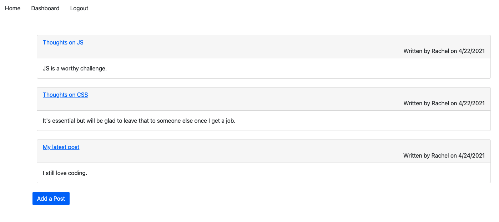

# Tech Blog
## Table of Contents

1. [Description](#description)
2. [Installation](#installation-instructions)
3. [Usage](#usage)
4. [Contributing](#contributers)
5. [License](#license)

### Description
An app that uses Node.js, Express, MySQL, Handlebars, and Sequelize to create a CMS-style blog, not unlike Wordpress. Users can publish posts and comment on posts.

### Installation Instructions
To install from GitHub, follow these steps:
1. Pull the repository.
2. Within the terminal, npm init and npm install.
3. Use the schema.sql file to create the database.
4. Using the .env.EXAMPLE file, create an .env with your credentials.
5. Enter 'npm run seed' in the terminal.

### Usage
From the terminal, enter 'npm start'.

**Example Route in Insomnia**

[Link to Application](https://github.com/rachelamos/tech-blog)

### Deployment
[Link to Heroku](https://salty-ocean-05546.herokuapp.com/)

### Questions
If you have any other questions, you can reach me:
- via email: rachelamos35@gmail.com
- via GitHub: https://github.com/rachelamos

### License
This project is covered under the [MIT](LICENSE) license.

### Contributers
© Rachel Amos